# Software Design Document (SDD)
## ValuePilotage — Indian Stock AI Platform

**Version:** 1.0  
**Date:** August 2026  
**Repository:** https://github.com/intaazansari/indian_stock_ai

---

## Table of Contents

1. [System Overview](#1-system-overview)
2. [Architecture Diagram](#2-architecture-diagram)
3. [Component Responsibilities](#3-component-responsibilities)
4. [Data Models](#4-data-models)
5. [Sequence Diagrams](#5-sequence-diagrams)
   - 5.1 Application Startup & Health Check
   - 5.2 User Registration & Login (JWT Auth)
   - 5.3 Home Page — Company Search
   - 5.4 Company Page Load (Full Profile)
   - 5.5 Live Price & Price History (yfinance)
   - 5.6 AI Analysis — Cache Hit (Fast Path)
   - 5.7 AI Analysis — Cache Miss → LLM Stream (Slow Path)
   - 5.8 Screener — Filter Companies
   - 5.9 Watchlist — Add / Remove
   - 5.10 Daily Price Refresh (GitHub Actions → Neon)
   - 5.11 Weekly Holdings Refresh (GitHub Actions → Neon)
   - 5.12 Quarterly Financials Refresh (GitHub Actions → Neon)
   - 5.13 Keep-Backend-Warm Cron (GitHub Actions → Render)
   - 5.14 Backend Cold-Start & Banner Lifecycle (Vercel → Render)
6. [API Reference Summary](#6-api-reference-summary)
7. [Infrastructure & Deployment](#7-infrastructure--deployment)
8. [Error Handling Strategy](#8-error-handling-strategy)
9. [Security Design](#9-security-design)

---

## 1. System Overview

ValuePilotage is an AI-powered equity research platform for NSE-listed Indian companies.

| Concern | Solution |
|---------|----------|
| **Frontend** | Next.js 15 on **Vercel** (free, unlimited) |
| **Backend API** | FastAPI (Python) on **Render** free tier |
| **Database** | **Neon** PostgreSQL (serverless, free tier) |
| **Cache** | **Render Redis** (Valkey 8, free 25 MB) |
| **AI / LLM** | Groq API via OpenAI-compatible SDK + **LangGraph** agents |
| **Data Pipeline** | GitHub Actions cron jobs (ubuntu-latest VMs) |
| **Background Workers** | Celery (currently disabled — tasks run sync) |

---

## 2. Architecture Diagram

```
┌──────────────────────────────────────────────────────────────────────┐
│                         INTERNET / USERS                             │
└─────────────────────────────┬────────────────────────────────────────┘
                              │ HTTPS
                              ▼
┌─────────────────────────────────────────────────────┐
│              VERCEL  (Frontend — Free)               │
│                                                      │
│   Next.js 15  (valuepilotage.com)                   │
│   ┌──────────────────────────────────────────────┐  │
│   │  Pages: Home / Company / Screener /          │  │
│   │         Watchlist / Login / Signup           │  │
│   │  Proxy rewrites:                             │  │
│   │    /api/*   → Render backend /api/*          │  │
│   │    /health  → Render backend /health         │  │
│   └──────────────────────────────────────────────┘  │
└──────────────────────┬──────────────────────────────┘
                       │ Server-side proxy (no CORS)
                       ▼
┌─────────────────────────────────────────────────────┐
│            RENDER  (Backend — Free Tier)             │
│                                                      │
│   FastAPI  isa-backend-bpbt.onrender.com            │
│   ┌──────────────────────────────────────────────┐  │
│   │  Middleware: CORS, RateLimit, ReqLogging     │  │
│   │  Routers: auth / companies / financials /    │  │
│   │           analysis / search / screener /     │  │
│   │           watchlist / portfolio / market     │  │
│   │  Services: AuthService / CompanyService /    │  │
│   │            AnalysisService / FinancialService│  │
│   │  Agents (LangGraph):                         │  │
│   │    SupervisorAgent → ResearchAgent           │  │
│   │                    → FinancialAnalysisAgent  │  │
│   │                    → BusinessQualityAgent    │  │
│   │                    → ValuationAgent          │  │
│   │                    → RiskAgent               │  │
│   │                    → ManagementAgent         │  │
│   │                    → QuarterlyResultsAgent   │  │
│   │                    → ExecutiveSummaryAgent   │  │
│   └──────────────────────────────────────────────┘  │
│                        │             │               │
│               asyncpg  │    redis    │               │
└────────────────────────┼─────────────┼───────────────┘
                         │             │
          ┌──────────────┘             └─────────────┐
          ▼                                          ▼
┌──────────────────────┐            ┌───────────────────────┐
│   NEON  (Postgres)    │            │  RENDER Redis (Valkey) │
│   Serverless DB       │            │  25 MB free cache      │
│   Tables:             │            │  TTL-based analysis    │
│    companies          │            │  cache + rate limiting │
│    income_statements  │            └───────────────────────┘
│    balance_sheets     │
│    cash_flows         │
│    key_ratios         │
│    analysis_cache     │
│    users              │
│    watchlists         │
│    portfolios         │
└──────────────────────┘
          ▲
          │ Direct DB connection (no backend involved)
┌─────────────────────────────────────────────────────┐
│         GITHUB ACTIONS  (Data Pipeline)              │
│                                                      │
│   daily-price-refresh.yml     (Mon–Fri 16:00 IST)   │
│   weekly-holdings-refresh.yml (Sunday  23:30 IST)   │
│   quarterly-financials.yml    (4× per year)         │
│   keep-backend-warm.yml       (every 14 min,        │
│                                06:00–02:00 IST)     │
└─────────────────────────────────────────────────────┘
          │
          ▼ GROQ API (LLM)
┌──────────────────────┐
│   GROQ               │
│   gpt-oss-120b model │
│   OpenAI-compatible  │
└──────────────────────┘
```

---

## 3. Component Responsibilities

### 3.1 Frontend (Next.js — Vercel)

| Component | File | Responsibility |
|-----------|------|----------------|
| `BackendWakeupBanner` | `providers/BackendWakeupBanner.tsx` | Polls `/health` every 10s; shows amber banner after 2 consecutive failures; auto-invalidates TanStack Query cache when backend recovers |
| `apiClient` | `lib/api/client.ts` | Axios instance with `/api/v1` base; injects JWT Bearer token; handles 401 → auto-refresh → redirect |
| `next.config.ts` | root | Proxy rewrites: `/api/*` and `/health` → Render backend (eliminates CORS) |
| Auth Store | `stores/` | Zustand store managing `access_token` / `refresh_token` in localStorage |
| Pages | `app/(dashboard)/` | Company page, Screener, Watchlist, Portfolio |

### 3.2 Backend (FastAPI — Render)

| Layer | Responsibility |
|-------|---------------|
| **Middleware** | `RateLimitMiddleware` (IP-level), `RequestLoggingMiddleware` (structlog + request_id), `CORSMiddleware` |
| **Routers** | Route dispatching for 9 endpoint modules |
| **Endpoints** | Thin HTTP handlers — validate input, call service, return response |
| **Services** | Business logic: `AnalysisService`, `AuthService`, `CompanyService`, `FinancialService` |
| **Repositories** | Data access layer: `CompanyRepository`, `FinancialRepository`, `UserRepository` |
| **Agents** | `SupervisorAgent` (LangGraph) routes to 8 specialized sub-agents |
| **Models** | SQLAlchemy ORM: `Company`, `IncomeStatement`, `BalanceSheet`, `CashFlow`, `KeyRatio`, `AnalysisCache`, `User`, `Watchlist` |

### 3.3 Data Pipeline (GitHub Actions)

| Workflow | Trigger | What it does |
|----------|---------|-------------|
| `daily-price-refresh` | Mon–Fri 16:00 IST | yfinance `fast_info` → updates CMP, market cap, 52W H/L |
| `weekly-holdings-refresh` | Sunday 23:30 IST | Screener.in scrape → updates promoter/FII/DII % |
| `quarterly-financials` | Manual + 4 dates/year | Screener.in full scrape → P&L, BS, CF, Key Ratios |
| `keep-backend-warm` | Every 14 min (06:00–02:00 IST) | `curl /health` → prevents Render 15-min spin-down |

---

## 4. Data Models

```
┌────────────────────────────────────────────────────────────────────┐
│  companies                                                          │
│  id (UUID PK) | name | nse_symbol | bse_code | isin               │
│  sector | industry | market_cap_cr | cmp | week52_high/low         │
│  promoter_holding_pct | fii_holding_pct | dii_holding_pct          │
│  description | website | founded_year | headquarters               │
└───┬────────────────────────────────────────────────────────────────┘
    │ 1:N
    ├──► income_statements  (period_year, period_type, revenue_cr, pat_cr ...)
    ├──► balance_sheets     (period_year, period_type, total_assets_cr ...)
    ├──► cash_flows         (period_year, period_type, operating_cf_cr ...)
    ├──► key_ratios         (period_year, period_type, pe_ratio, pb_ratio,
    │                        roe_pct, roce_pct, debt_equity_ratio ...)
    ├──► analysis_cache     (agent_type, analysis_json, generated_at, ttl_hours)
    └──► watchlist_items    (user_id FK → users)

┌────────────────────────────────────────────────────────────────────┐
│  users                                                              │
│  id (UUID PK) | email (unique) | full_name | hashed_password       │
│  is_active | is_verified | created_at | updated_at                 │
└───┬────────────────────────────────────────────────────────────────┘
    │ 1:N
    └──► watchlists (id, user_id, company_id, created_at)
```

---

## 5. Sequence Diagrams

---

### 5.1 Application Startup & Health Check

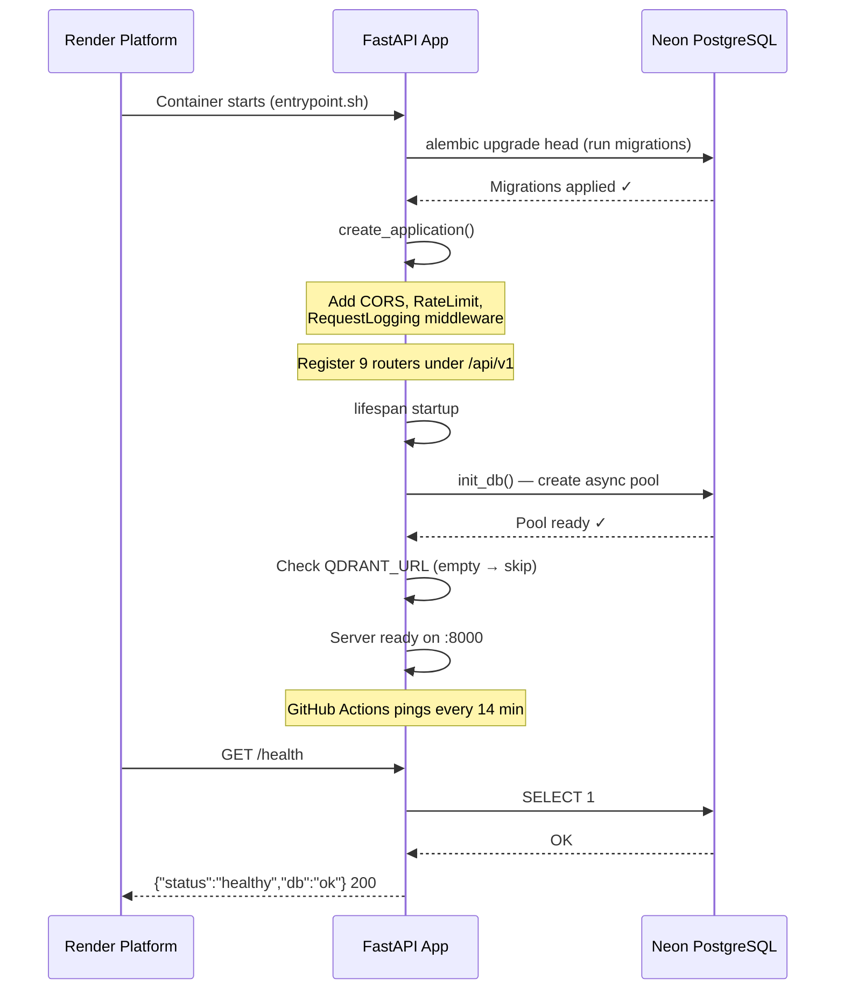

---

### 5.2 User Registration & Login (JWT Auth)

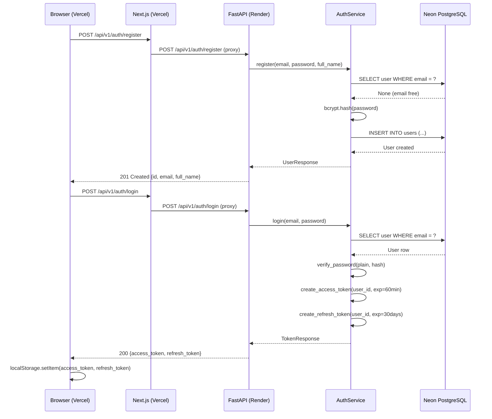

---

### 5.3 Home Page — Company Search

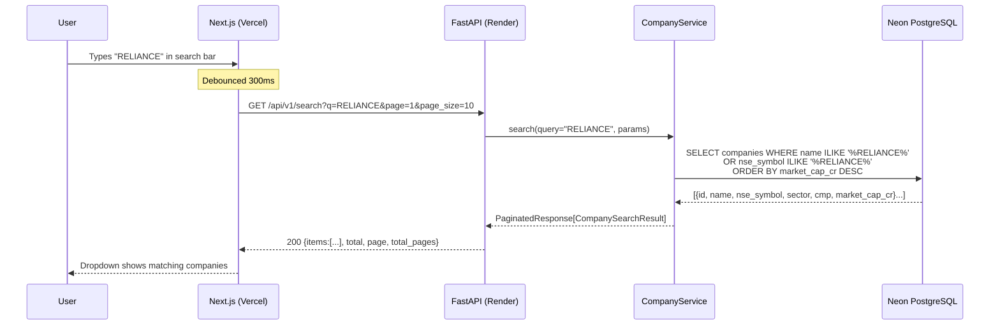

---

### 5.4 Company Page Load (Full Profile)

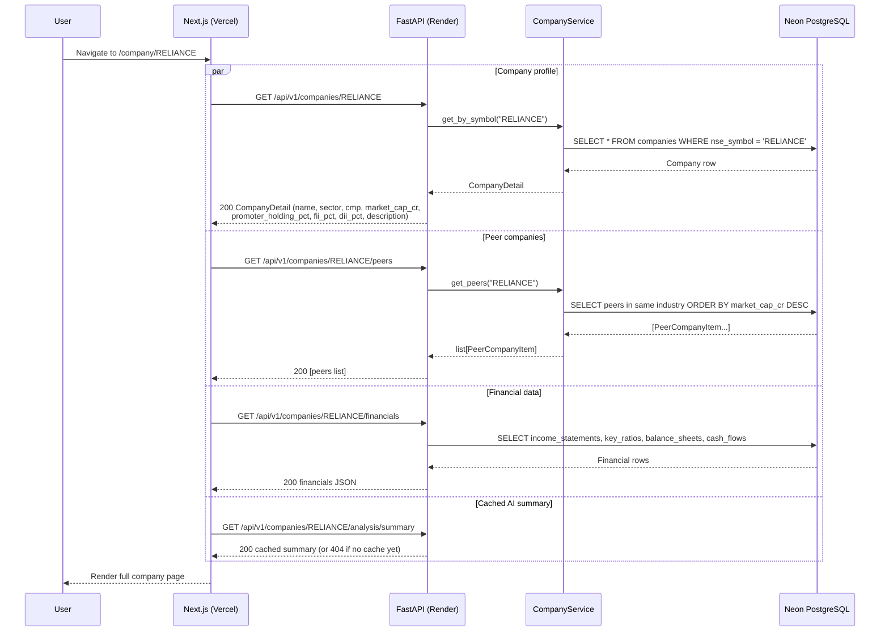

---

### 5.5 Live Price & Price History (yfinance)

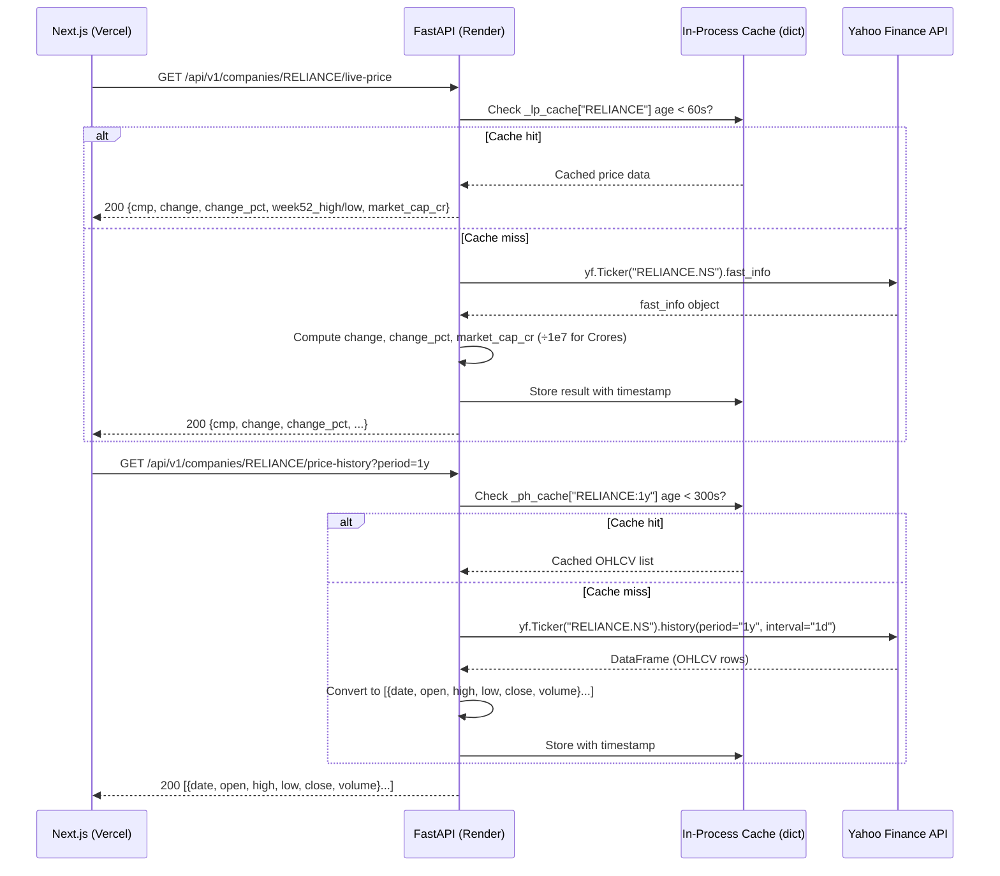

---

### 5.6 AI Analysis — Cache Hit (Fast Path)

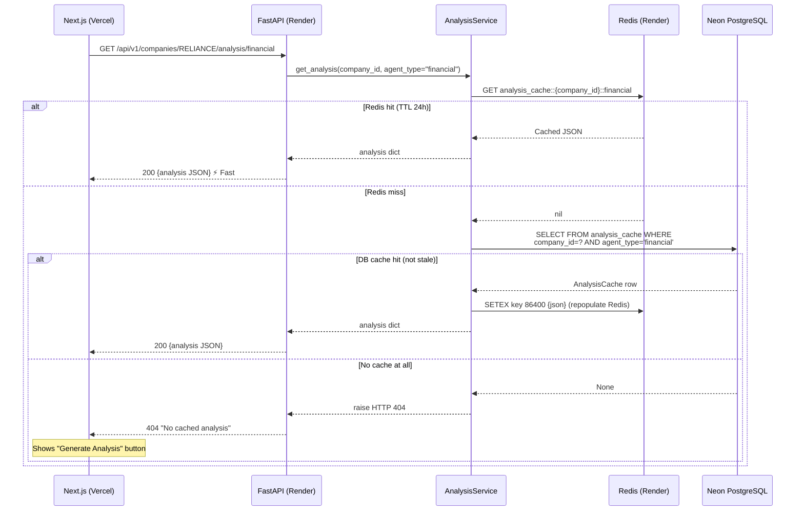

---

### 5.7 AI Analysis — Cache Miss → LLM Stream (Slow Path)

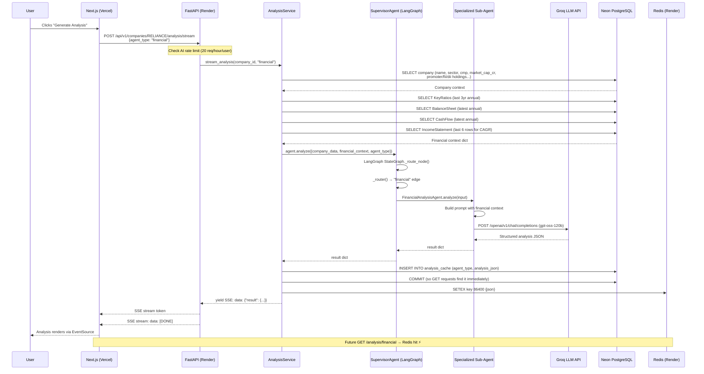

---

### 5.8 Screener — Filter Companies

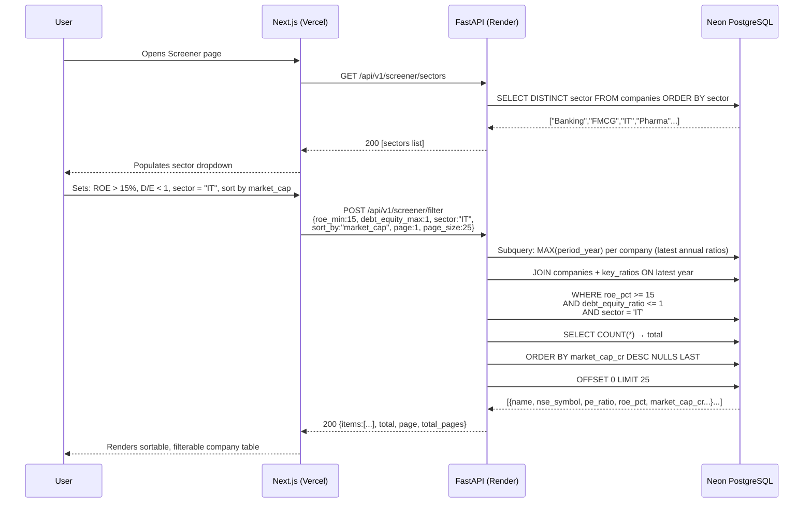

---

### 5.9 Watchlist — Add / Remove

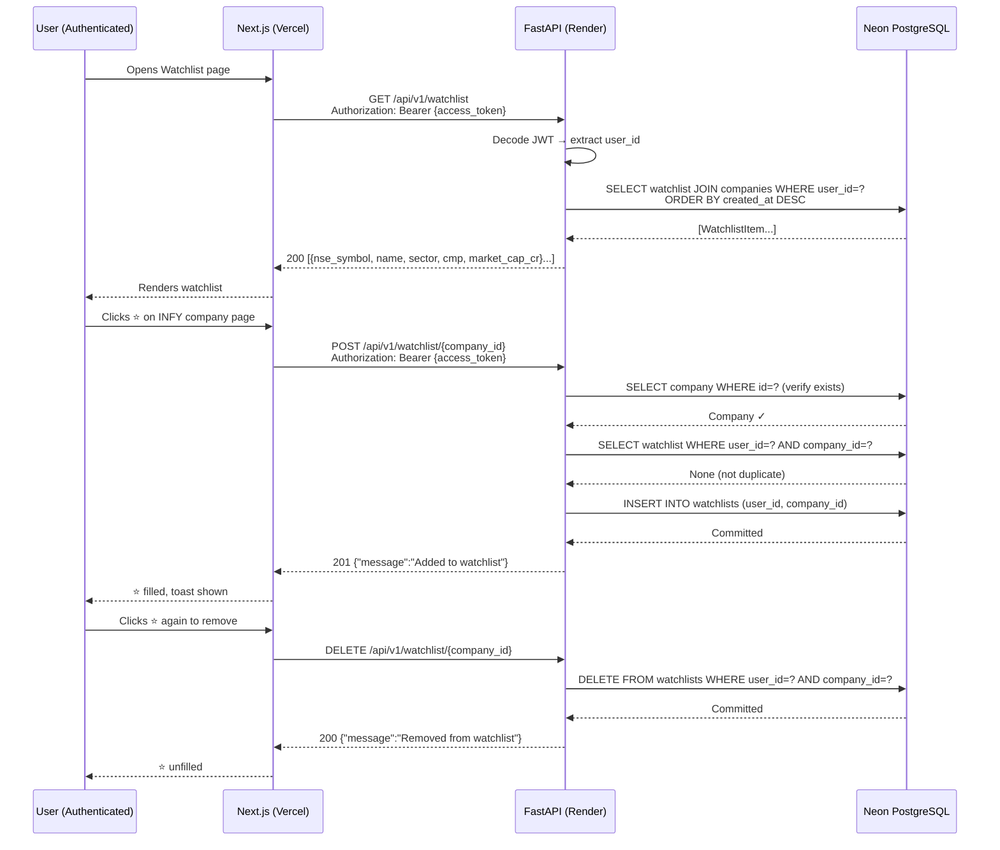

---

### 5.10 Daily Price Refresh (GitHub Actions → Neon)

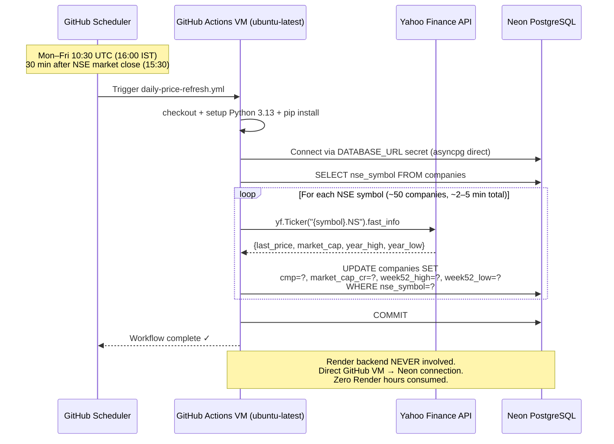

---

### 5.11 Weekly Holdings Refresh (GitHub Actions → Neon)

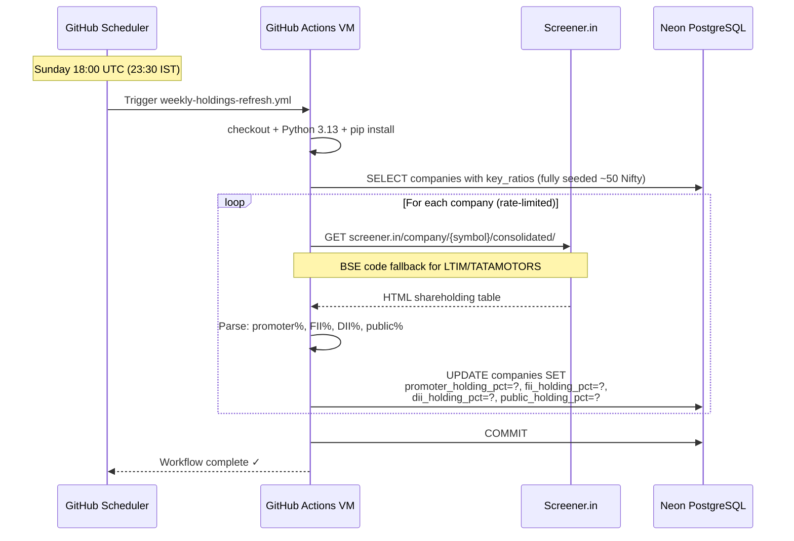

---

### 5.12 Quarterly Financials Refresh (GitHub Actions → Neon)

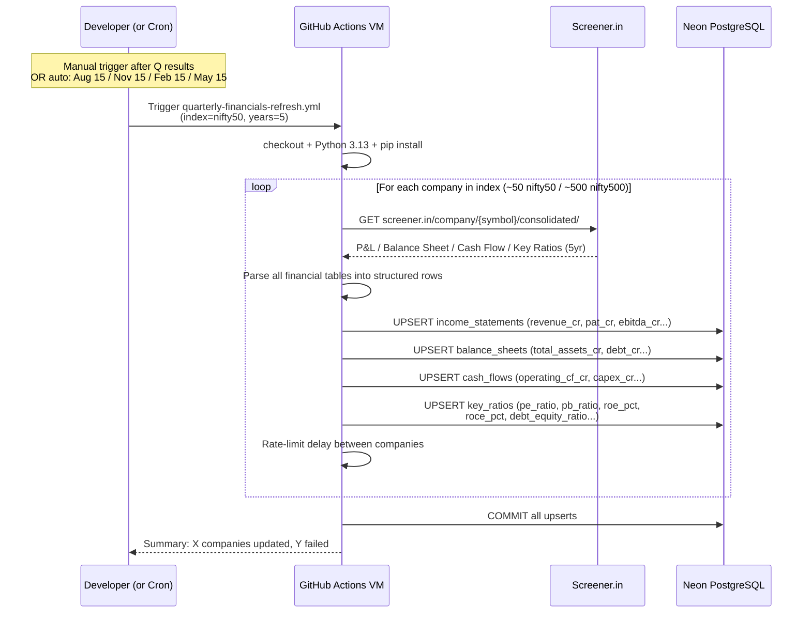

---

### 5.13 Keep-Backend-Warm Cron

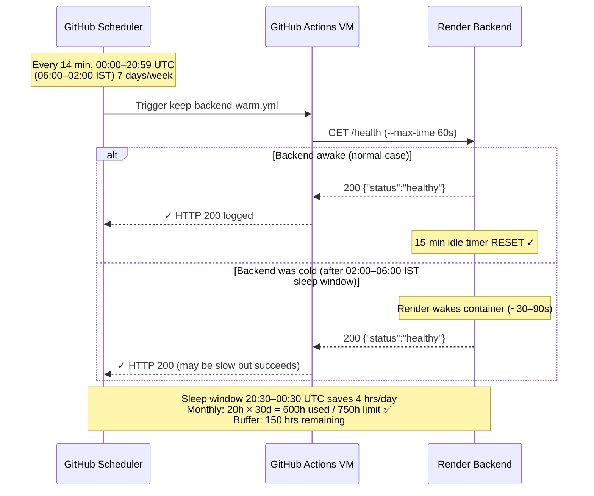

---

### 5.14 Backend Cold-Start & Banner Lifecycle

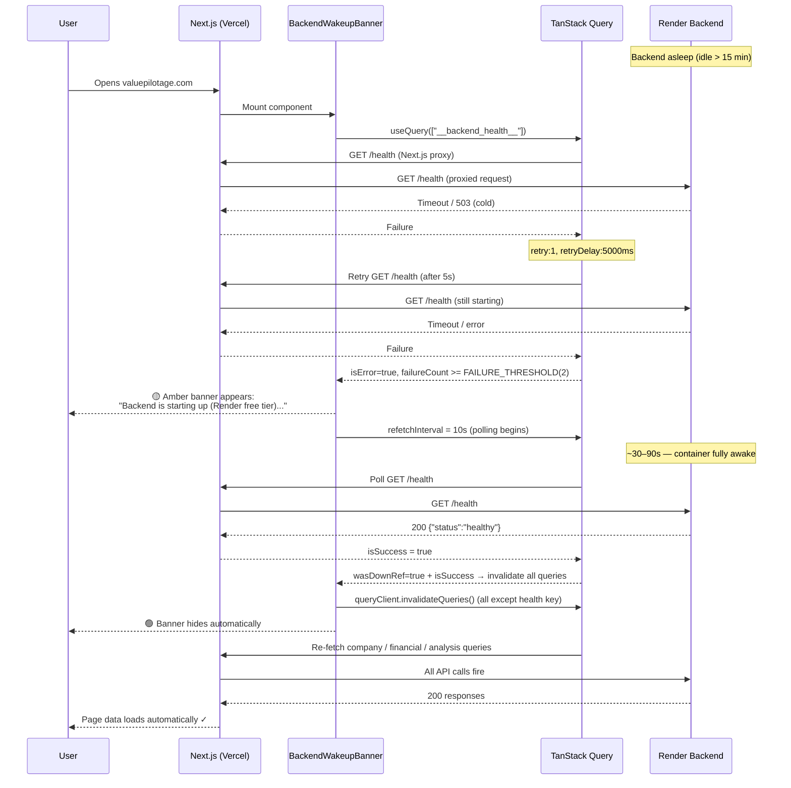

---

## 6. API Reference Summary

| Method | Endpoint | Auth | Description |
|--------|----------|------|-------------|
| POST | `/api/v1/auth/register` | ❌ | Register new user |
| POST | `/api/v1/auth/login` | ❌ | Login → JWT tokens |
| POST | `/api/v1/auth/refresh` | ❌ | Refresh access token |
| GET | `/api/v1/auth/me` | ✅ JWT | Get current user profile |
| PATCH | `/api/v1/auth/me` | ✅ JWT | Update profile |
| POST | `/api/v1/auth/me/change-password` | ✅ JWT | Change password |
| GET | `/api/v1/companies/{symbol}` | ❌ | Full company profile |
| GET | `/api/v1/companies/{symbol}/peers` | ❌ | Peer companies |
| GET | `/api/v1/companies/{symbol}/price-history?period=` | ❌ | OHLCV history (yfinance, 5min cache) |
| GET | `/api/v1/companies/{symbol}/live-price` | ❌ | Live CMP + stats (60s cache) |
| GET | `/api/v1/companies/{symbol}/analysis/{agent_type}` | ❌ | Cached AI analysis |
| POST | `/api/v1/companies/{symbol}/analysis/stream` | ⚠️ Rate-limited | Fresh AI analysis via SSE |
| GET | `/api/v1/search?q=&page=&page_size=` | ❌ | Search companies |
| GET | `/api/v1/screener/sectors` | ❌ | List sectors for dropdown |
| POST | `/api/v1/screener/filter` | ❌ | Screen companies by financial criteria |
| GET | `/api/v1/watchlist` | ✅ JWT | User's watchlist |
| POST | `/api/v1/watchlist/{company_id}` | ✅ JWT | Add to watchlist |
| DELETE | `/api/v1/watchlist/{company_id}` | ✅ JWT | Remove from watchlist |
| GET | `/health` | ❌ | Health check (pings Neon DB) |

### AI Agent Types

| `agent_type` | Description |
|--------------|-------------|
| `research` | Business overview, moat, competitive position |
| `financial` | Revenue/PAT trends, margins, ROCE, ROE |
| `quality` | Business quality score, consistency |
| `valuation` | PE, PB, EV/EBITDA vs peers, fair value |
| `risk` | Key risk factors, debt, regulatory exposure |
| `management` | Management quality, promoter track record |
| `quarterly` | Latest quarter highlights, YoY/QoQ |
| `summary` | Executive summary combining all dimensions |

---

## 7. Infrastructure & Deployment

```
DEPLOYMENT PIPELINE
═══════════════════
Developer push to GitHub master
        │
        ├──► Vercel (auto-deploy frontend)
        │    - Build: next build (Vercel native, no Docker)
        │    - Env:   NEXT_PUBLIC_API_URL in Vercel dashboard
        │             → https://isa-backend-bpbt.onrender.com
        │
        └──► Render (auto-deploy backend via render.yaml)
             - Build: Docker (infrastructure/docker/backend.Dockerfile)
             - Context: ./backend
             - Entrypoint: entrypoint.sh
               1. alembic upgrade head   ← DB migrations first
               2. uvicorn app.main:app --host 0.0.0.0 --workers 2

RESOURCE PLAN (September 2026+)
════════════════════════════════
Service          Platform    Cost    Notes
───────────────────────────────────────────────────────
isa-backend      Render      Free    750 hr/month shared
isa-redis        Render      Free    Valkey 8, 25MB — no instance hours
Neon DB          Neon        Free    0.5GB storage, serverless compute
Frontend         Vercel      Free    Unlimited deployments
Data Pipeline    GitHub      Free    Actions 2000 min/month
Groq LLM         Groq        PAYG    Only on cache miss

RENDER HOUR BUDGET (September)
═══════════════════════════════
Backend awake:  20 hrs/day × 30 days = 600 hrs ✅
Sleep window:   02:00–06:00 IST (4 hrs off daily)
Buffer:         150 hrs remaining from 750hr limit
```

---

## 8. Error Handling Strategy

| Layer | Strategy |
|-------|----------|
| **Frontend network** | `parseApiError()` in `client.ts` — network errors → "starting up" message; HTTP errors → show `detail` from API |
| **Banner** | Shows only after 2 confirmed failures (`FAILURE_THRESHOLD=2`); retry once before confirming; auto-hides + re-fetches on recovery |
| **FastAPI global** | `ApplicationError` handler → JSON `{detail:"..."}` with correct HTTP status |
| **AnalysisService** | Redis unavailable is non-fatal — logs warning, falls back to PostgreSQL cache |
| **Health endpoint** | DB failure → `db:"warming_up"` but still returns HTTP 200 (Neon cold start expected, not a crash) |
| **Data pipeline** | Per-company try/except — one failed company never stops the batch; summary printed at end |
| **LangGraph agents** | SupervisorAgent catches agent errors; propagated as HTTP 500 |

---

## 9. Security Design

| Concern | Implementation |
|---------|---------------|
| **Authentication** | JWT HS256, `ACCESS_TOKEN_EXPIRE_MINUTES=60`, `REFRESH_TOKEN_EXPIRE_DAYS=30` |
| **Password storage** | bcrypt hash — plain password never stored or logged anywhere |
| **Token auto-refresh** | `client.ts` interceptor: 401 → refresh → retry; failure → clear tokens → `/login` |
| **CORS** | Tightly scoped to `valuepilotage.com`, `www.valuepilotage.com`, `isa-frontend.onrender.com`, `localhost:3000` only |
| **Rate limiting** | General: 60 req/min/IP (middleware); AI endpoints: 20 req/hour/user (dependency) |
| **Secrets** | All via Render / Vercel / GitHub environment variables — nothing in code |
| **DB URL** | `fix_database_url` validator auto-converts `postgresql://` → `postgresql+asyncpg://` and `sslmode` → `ssl` param |
| **DEBUG enforcement** | `model_validator` raises `ValueError` if `DEBUG=True` in production environment |
| **API docs** | `/api/docs` and `/api/redoc` only when `DEBUG=True` — disabled in production |
| **Allowed hosts** | `ALLOWED_HOSTS=["isa-backend-bpbt.onrender.com","localhost","127.0.0.1"]` |
| **SECRET_KEY** | Must be ≥ 32 chars (validated at startup); auto-generated by Render on first deploy |
